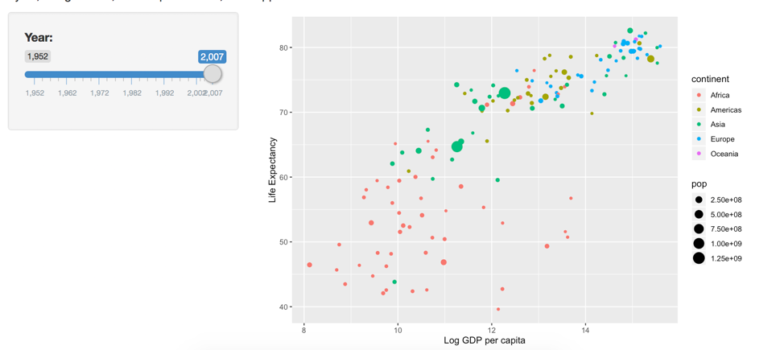

```{r setup, include=FALSE}
knitr::opts_chunk$set(echo = FALSE, message=FALSE, warning=FALSE, fig.height = 4, fig.width = 6 )
```


```{r}
library(tidyverse) 
```

## Discussion Article

A ~500 word article on the most interesting findings in your project. Your audience for this report should be a Lawrence student who may or may not have taken any statistics or data science courses. 

Include two screen shots of your Shiny App. You may insert images and adjust their width as shown below. 
Make sure your image is in the same folder as the .Rmd file.

{width=500px}

## Technical Report 

What were the biggest challenges you faced, and how did you overcome them? Your audience for this part is me (the instructor), and your goal should be to show me that you have achieved a deep understanding and ease-of-use with the topics you learned in this course.
